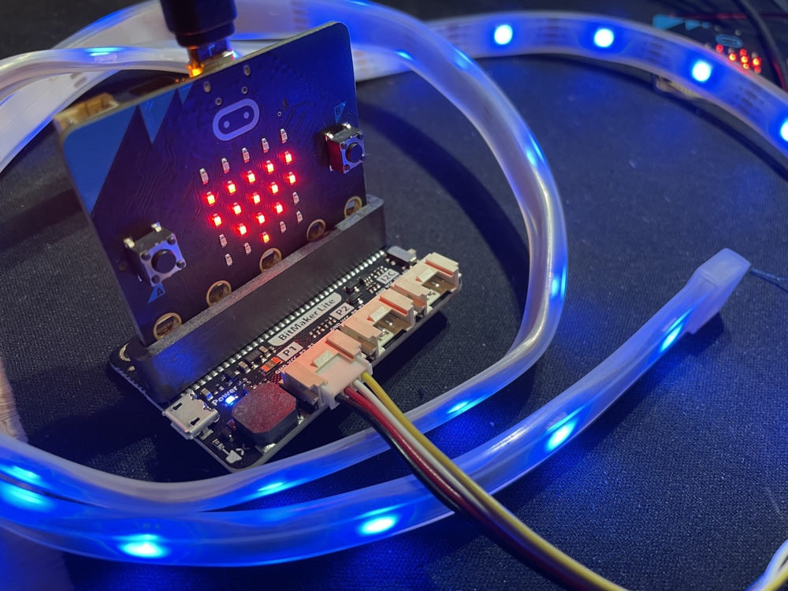

# Micro:bit Lamp (V1)

This Makeblock project controls a string of Neopixels connected to Pin 1 on a BBC Microbit. Button A changes colour (in 12 steps around the colour wheel) and Button B changes brightness (from off to full brightness in 5 steps).

The script also transmits and receives hue, saturation and luminosity values, allowing a second Microbit to be used as a controller for a lamp, or multiple lamps to synchronise with one another. A unique radio channel number should be used to pair a single lamp with a single remote control.

## Open in MakeCode

Ppen the URL: https://github.com/seancuttlefish/microbit-lamp
